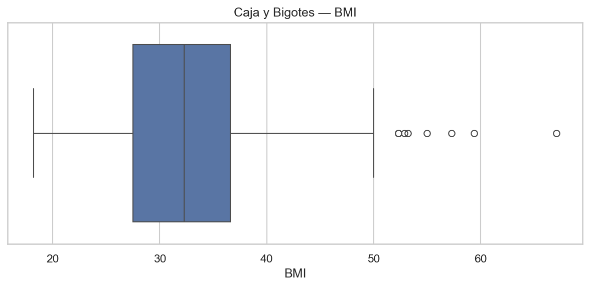

# Reporte — Dos variables: BMI y Age
## Visualización y Análisis de Datos (2 variables)

**Diagrama de barras — BMI**

_Explicación_: La mayor concentración está en el bin **(27.98, 32.87]** (207 obs, 27.0%). Rango total [18.20, 67.10], media 32.46, mediana 32.30.

**Histograma — BMI**

_Explicación_: Distribución sesgada a la derecha (skew=0.60); dispersión (std=6.88). La media vs mediana sugiere cola derecha.

**Caja y Bigotes — BMI**

_Explicación_: Mediana 32.30, Q1=27.50, Q3=36.60 (IQR=9.10). Posibles atípicos (regla IQR): **8**. Umbrales: [13.85, 50.25].

**Diagrama de barras — Age**

_Explicación_: La mayor concentración está en el bin **(20.999, 27.0]** (332 obs, 43.2%). Rango total [21.00, 81.00], media 33.24, mediana 29.00.

**Histograma — Age**

_Explicación_: Distribución sesgada a la derecha (skew=1.13); dispersión (std=11.76). La media vs mediana sugiere cola derecha.

**Caja y Bigotes — Age**

_Explicación_: Mediana 29.00, Q1=24.00, Q3=41.00 (IQR=17.00). Posibles atípicos (regla IQR): **9**. Umbrales: [-1.50, 66.50].

**Mapa de calor (correlación entre las dos variables)**

_Explicación_: Corr(BMI, Age) = **0.026** → correlación **baja positiva**.

**Rangos y estadísticos (solo 2 variables)**

|     |   min |   max |   mean |   median |    std |   skew |
|:----|------:|------:|-------:|---------:|-------:|-------:|
| BMI |  18.2 |  67.1 | 32.455 |     32.3 |  6.875 |  0.599 |
| Age |  21   |  81   | 33.241 |     29   | 11.76  |  1.13  |

**Atípicos por IQR (conteo)**

|     |   posibles_atipicos_IQR |
|:----|------------------------:|
| BMI |                       8 |
| Age |                       9 |

### Respuestas — Visualización y Análisis (solo BMI y Age)

**1) ¿Hay alguna variable que no aporta información?**  
Ninguna muestra varianza ~0; ambas aportan variabilidad.

**2) Si tuvieras que eliminar variables, ¿cuáles y por qué?**  
Eliminación solo si hubiera varianza casi nula o correlación ~1 con otra variable; con estas dos no aplica.

**3) Rangos (min–max):**  
- **BMI**: min=18.2, max=67.1
- **Age**: min=21.0, max=81.0

**4) ¿Existen datos atípicos?**  
(Criterio IQR)
- **BMI**: 8
- **Age**: 9

**5) ¿Existe correlación alta?**  
Corr(BMI, Age) = 0.026 → baja positiva.

